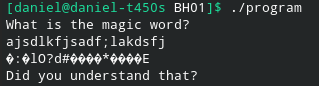
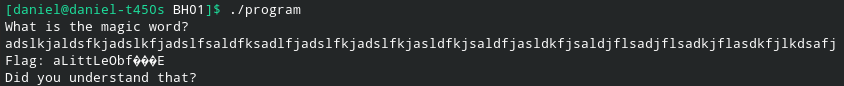
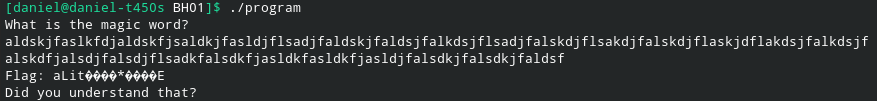
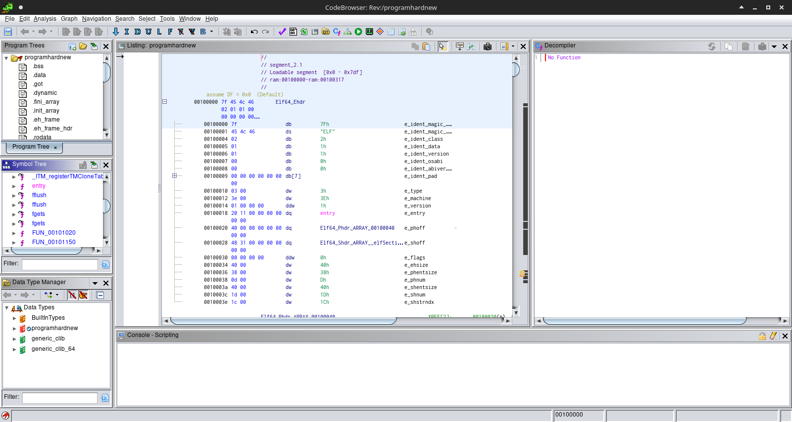
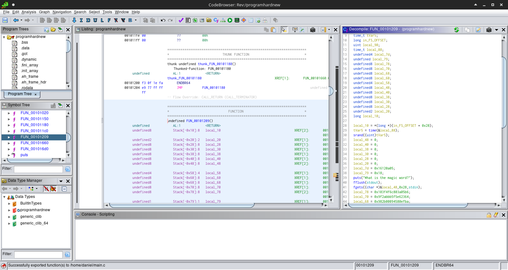
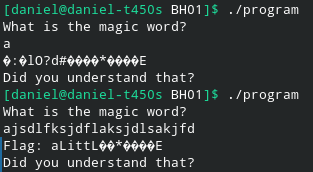
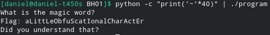

Let's run the program first and see what happens:



Hmm...let's try a larger input.



Oooh! We get a bit of coherent text! Let's try an even larger input:



That's strange, there's even less coherent text now. Let's open the binary up in Ghidra:



There's no main function, so let's click around. `FUN_00101209` seems to have some interesting output. It looks like it's probably the main function:



Let's have a look at the code:

```c
undefined8 FUN_00101209(void)

{
  byte bVar1;
  byte bVar2;
  int iVar3;
  uint uVar4;
  time_t tVar5;
  long in_FS_OFFSET;
  uint local_90;
  time_t local_88;
  undefined4 local_7d;
  undefined local_79;
  undefined8 decodedFlag;
  undefined8 local_70;
  undefined8 local_68;
  undefined8 local_60;
  undefined4 local_58;
  undefined8 local_48;
  undefined8 local_40;
  undefined8 local_38;
  undefined8 local_30;
  undefined8 local_28;
  undefined2 local_20;
  long local_10;
  
  local_10 = *(long *)(in_FS_OFFSET + 0x28);
  tVar5 = time(&local_88);
  srand((uint)tVar5);
  local_48 = 0;
  local_40 = 0;
  local_38 = 0;
  local_30 = 0;
  local_28 = 0;
  local_20 = 0;
  local_7d = 0x16120a05;
  local_79 = 0x18;
  puts("What is the magic word?");
  fflush(stdout);
  fgets((char *)&local_48,0x28,stdin);
  decodedFlag = 0x103f4f6c803a05b6;
  local_70 = 0x9f2abbb5f5e62364;
  local_68 = 0x982b00094580efba;
  local_60 = 0x3f4675fb93f9dfb2;
  local_58 = 0x1afcba39;
  iVar3 = rand();
  uVar4 = (int)*(char *)((long)&local_48 + (long)(int)*(char *)((long)&local_7d + (long)(iVar3 % 5))) - 0x5a;
  local_90 = 0;
  while (local_90 < uVar4) {
    bVar1 = ~*(byte *)((long)&decodedFlag + (ulong)local_90) + 0x2f;
    bVar2 = (byte)local_90;
    bVar1 = (~(~(0x57 - (~(bVar1 * -0x80 | bVar1 >> 1) - 0x33)) - 0x3f) ^ bVar2) + 0x4e ^ bVar2;
    bVar1 = ~((bVar1 * '\x02' | bVar1 >> 7) + 0x3d) ^ bVar2;
    bVar1 = ~(bVar1 << 3 | bVar1 >> 5);
    if ((int)uVar4 < 0) break;
    bVar1 = ~((bVar1 << 5 | bVar1 >> 3) - bVar2) - 0x17;
    bVar1 = ~((bVar1 * -0x80 | bVar1 >> 1) - bVar2);
    bVar1 = 0xad - ((bVar1 << 3 | bVar1 >> 5) + 0x3c);
    bVar1 = (bVar1 * ' ' | bVar1 >> 3) + bVar2;
    bVar1 = (bVar1 * '\b' | bVar1 >> 5) - bVar2;
    bVar1 = ~(bVar1 * -0x80 | bVar1 >> 1) ^ bVar2;
    bVar2 = (bVar1 * -0x40 | (byte)-bVar1 >> 2) - bVar2;
    bVar1 = ~(~(~(bVar2 * ' ' | bVar2 >> 3) ^ 0x45) - 8);
    *(byte *)((long)&decodedFlag + (ulong)local_90) = (0xd1 - ((bVar1 << 2 | bVar1 >> 6) ^ 0xef) ^ 0x65) - 0x3a;
    local_90 = local_90 + 1;
  }
  puts((char *)&decodedFlag);
  puts("Did you understand that?");
  if (local_10 == *(long *)(in_FS_OFFSET + 0x28)) {
    return 0;
  }
                    /* WARNING: Subroutine does not return */
  __stack_chk_fail();
}
```

Let's trim out some irrelevant code and rename some obvious variables. I've commented a few of the standout pieces of code:

```c
  currentTime = time(&local_88);
  srand((uint)currentTime); //a random number is generated using the system time as a seed
  userInput = 0;
  local_40 = 0;
  local_38 = 0;
  local_30 = 0;
  local_28 = 0;
  local_20 = 0;
  local_7d = 0x16120a05;
  local_79 = 0x18;
  puts("What is the magic word?");
  fflush(stdout);
  fgets((char *)&userInput,0x28,stdin); //the fgets buffer only goes up to 0x28 characters (40 characters)
  decodedFlag = 0x103f4f6c803a05b6;
  local_70 = 0x9f2abbb5f5e62364;
  local_68 = 0x982b00094580efba;
  local_60 = 0x3f4675fb93f9dfb2;
  local_58 = 0x1afcba39;
  randNum = rand();
  threshold = (int)*(char *)((long)&userInput + (long)(int)*(char *)((long)&local_7d + (long)(randNum % 5))) - 0x5a; //the user input is added to some random number % 5 and then the entire sum has 0x5a subtracted from it. 
  iterator = 0;
  //this while loop looks terrifying. I'm not even going to try to figure out how it works.
  while (iterator < threshold) {
    /*
    lots of scary operations
    */
    iterator = iterator + 1;
  }
  puts((char *)&decodedFlag);
  puts("Did you understand that?");
```

Now it's time for some deductive reasoning. After trying a few different inputs into the program, I noticed that longer inputs tended to decode more of the flag than shorter inputs:



Since the `threshold` variable is affected by the user input in some way, we can assume that a bigger `userInput` variable will lead to a higher threshold which leads to more iterations of the while loop. At this point I guessed that the while loop was decoding the flag a little bit each iteration that it ran. Let's look at that threshold variable a bit more closely:

```c
threshold = (int)*(char *)((long)&userInput + (long)(int)*(char *)((long)&local_7d + (long)(randNum % 5))) - 0x5a;
```

`userInput` is added to some fixed sum `local_7d` and `randNum % 5`. We can see now that the `rand()` is less terrifying than it seemed at first. Since it is being taken modulo 5, the largest that it can be is 4. This means that section is generally insignificant compared to the rest of the sum and can be safely ignored.

Where does this leave us? Our goal is to maximize `threshold` as much as possible because we want the while loop to run as many times as possible to decrypt our flag. This means we want to maximize `userInput`. I assumed that this meant we would want the maximum ASCII code character. I chose the tilde (~) character. Keeping in mind that the maximum amount of characters that will be processed is 40, here is the code to solve:

```bash
python -c "print('~'*40)" | ./program
```



> Flag: aLittLeObfuScatIonalCharActEr
