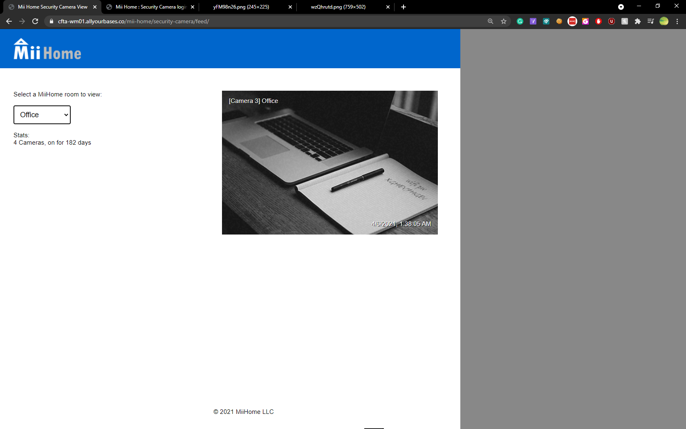

> https://cfta-wm01.allyourbases.co/new-images/

One of the pictures has mii-home, Add as a path

> https://cfta-wm01.allyourbases.co/mii-home/

Go to sources and check out this timeout function.

```javascript
function login(a, b) {
    const h = hl_b;
    document[h(0x75)](h(0x84))[h(0x72)] = !![];
    if (a === h(0x71) + 'ert@g' + h(0x89) + h(0x82) + h(0x78) && b === 'ne' + 'wy' + h(0x79))
        setTimeout(function() {
            const i = h;
            document['getElementById'](i(0x84))[i(0x83)] = i(0x77),
            document['getElementById'](i(0x84))[i(0x7f)] = 'loggingIn';
        }, 0x2bc),
        setTimeout(function() {
            const j = h;
            window[j(0x73)] = 'se' + 'curi' + 'ty-' + 'ca' + j(0x7d) + '/f' + j(0x70);
        }, 0xbb8);
    else {
        const c = [0x18, -0x18, 0xc, -0xc, 0x6, -0x6, 0x3, -0x3, 0x0];
        let d = -0x1
          , f = setInterval(function() {
            const k = h;
            d < c['length'] ? (d++,
            document[k(0x75)]('loginContainer')['style'][k(0x74)] = c[d] + 'px',
            d === 0x2 && (document[k(0x75)](k(0x7a))[k(0x83)] = '',
            document[k(0x75)](k(0x87))['value'] = '')) : (clearInterval(f),
            document[k(0x75)](k(0x84))[k(0x72)] = ![]);
        }, 0x32);
        return ![];
    }
}
```

`h(0x71) + 'ert@g' + h(0x89) + h(0x82) + h(0x78)`

This will return `rupert@get-vizual.med.ia`

And the setTimeout below that will log you into the website panel. 

```javascript
setTimeout(function() {
            const j = h;
            window[j(0x73)] = 'se' + 'curi' + 'ty-' + 'ca' + j(0x7d) + '/f' + j(0x70);
        }, 0xbb8);
```



> XGHEV7HGEV