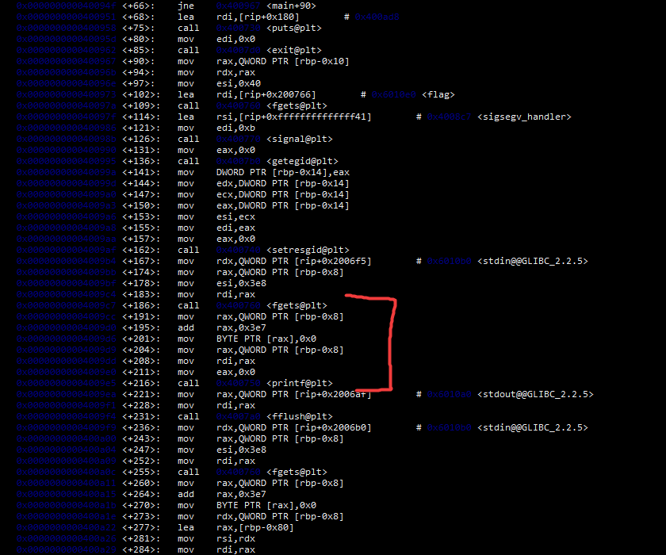
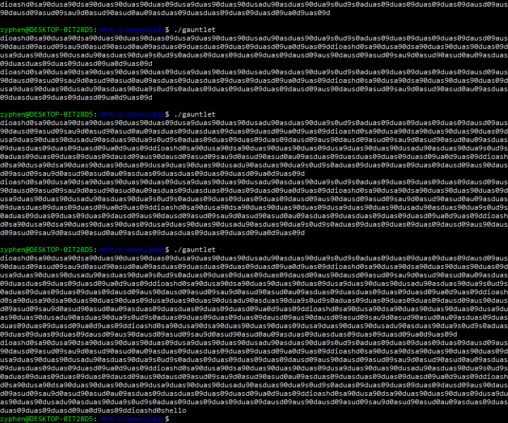

> This series of problems has to do with binary protections and how they affect exploiting a very simple program. How far can you make it in the gauntlet?
>
> nc mercury.picoctf.net 35363

Let us check out what's inside the binary of this file.

Based on the code that is marked by the bracket, it seems it asks for an input, then prints that input after sending it to the top of the stack. Due to the vulnerability with printf at top stack, and how it asks for another input again. This means there is room for a string to be sent even if useless. Let's test this theory. 

And how right we are. This means it can easily be solved by an overflow. 

> 53bb653334bce9d372ed35e599e50015