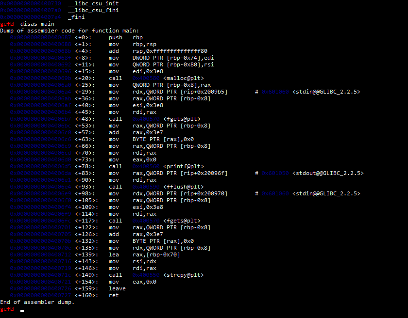
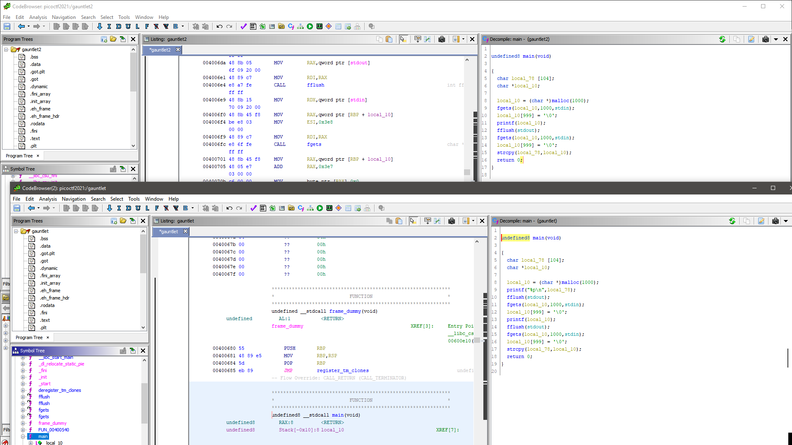

> How does ASLR affect your exploit? gauntlet `nc mercury.picoctf.net 1175`

ASLR is a stack randomization technique, meaning every restart it will have a new address, or stack location.

Based on this disassembly, we seem to be dealing with a less complex program, more similar to that of gauntlet 0, but it only makes sense as we are now randomizing without fixed values. So what does this mean?

Let's take a look at Ghidra. 

Hand in hand, they look almost the exact same, this compares Gauntlet 1 to 2. One is in front and the second is in back. With this idea, lets overflow by input and then send a shellcode!